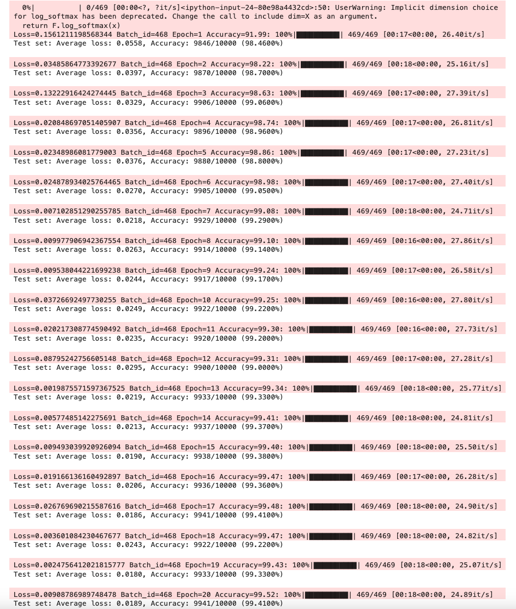

# ERA3

## Overview
This project implements a machine learning pipeline using GitHub Actions for continuous integration and testing.

## Features
- Automated model training
- Continuous integration with GitHub Actions
- CPU-optimized machine learning pipeline
- Automated testing suite

## Advanced Training of MNIST

<!-- Alternative HTML syntax for more control -->

